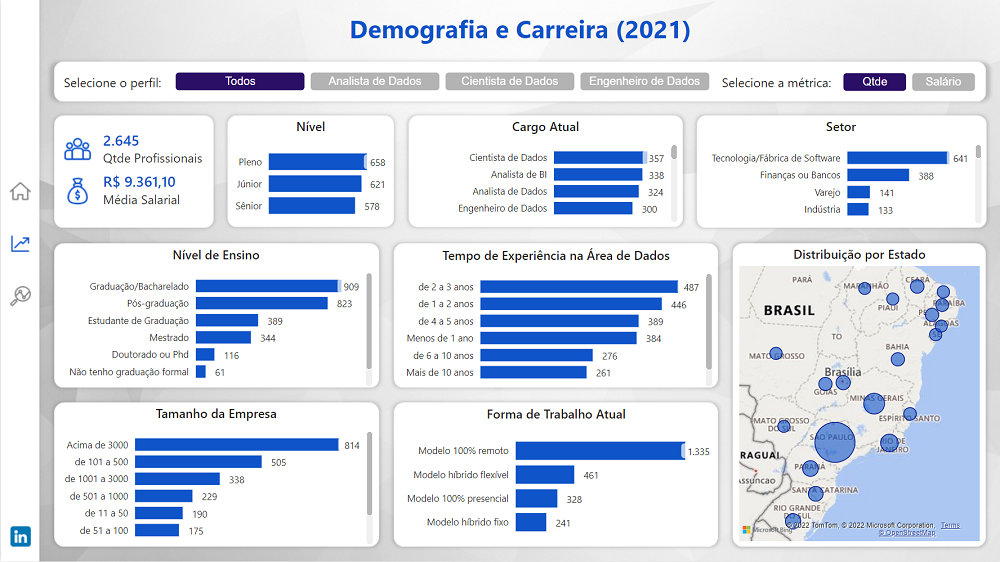

# Profissional de Dados do Brasil

## **Introdução do Problema**

Você conhece o perfil do Profissional de Dados do Brasil? 

Se você é um profissional de dados ou está pensando em migrar de carreira ou está interessado em saber melhor como é este profissional, precisa conhecer as atualizações da última pesquisa realizada pelo Data Hackers. 

**Problema**: Identificar e reportar em forma de dashboard as informações mais relevantes do Profissional de Dados no Brasil. 

**Dataset**: Dados foram extraídos do Kaggle do Data Hackers
* Link dos dados da Pesquisa de 2019: https://www.kaggle.com/datasets/datahackers/pesquisa-data-hackers-2019
* Link dos dados da Pesquisa de 2021: https://www.kaggle.com/datasets/datahackers/state-of-data-2021

## **Desenvolvimento**

Para o desenvolvimento do dashboard, utilizei os dados da pesquisa de 2021 e de 2019 para fins comparativos. 
* Na "Página Inicial", podemos visualizar um resumo com as comparações das médias salariais, qual o nível de ensino da maioria dos profissionais que responderam à pesquisa e quais ferramentas estão mais presentes no dia a dia do profissional.

* Em "Demografia e Carreira", podemos navegar pelos perfis e analisar a frequência (Qtde) ou a remuneração média (Salário) em relação ao nível, cargo, setor, nível de ensino, tempo de experiência na área de dados, tamanho da empresa, forma de trabalho (remoto, presencial ou híbrido) e estado.

* Em "Conhecimentos na Área de Dados", podemos extrair informações mais específicas do perfil selecionado, como por exemplo, ferramentas e linguagens mais utilizadas e atividades do dia a dia.

## **Conclusão**

As principais conclusões que podemos extrair dessas informações:
* Aumento salarial significativo independente do perfil.
* As linguagens mais utilizadas continuam sendo: Python e SQL.
* A ferramenta de BI que continua em primeiro lugar é o Power BI.
* Os bancos de dados mais utilizados são: SQL Server e PostgreSQL.
* A possibilidade de trabalhar com dados em diversos setores do mercado.
* Maior média salarial em empresas de porte grande e médio.
* Analista de Dados passa a maior parte do tempo desenvolvendo dashboards em ferramentas de BI e criando consultas em SQL.
* Cientista de Dados passa a maior parte do tempo coletando e limpando os dados para análise e criação de modelos, além disso realizam estudos para resolver problemas de negócio 
* Engenheiro de Dados passa a maior parte do tempo desenvolvendo pipeline de dados e criando consultas em SQL.

**Para acessar o dashboard**, clique neste link: https://app.powerbi.com/view?r=eyJrIjoiMDZhZTM3MGItMzJmMi00MjM3LTlmZDMtN2ExOGJkZTc1ZTE3IiwidCI6IjgxMTFjMzgxLThjM2EtNDNkMS05ODc4LTA5ZjAzZGQ0N2Y1NiJ9
