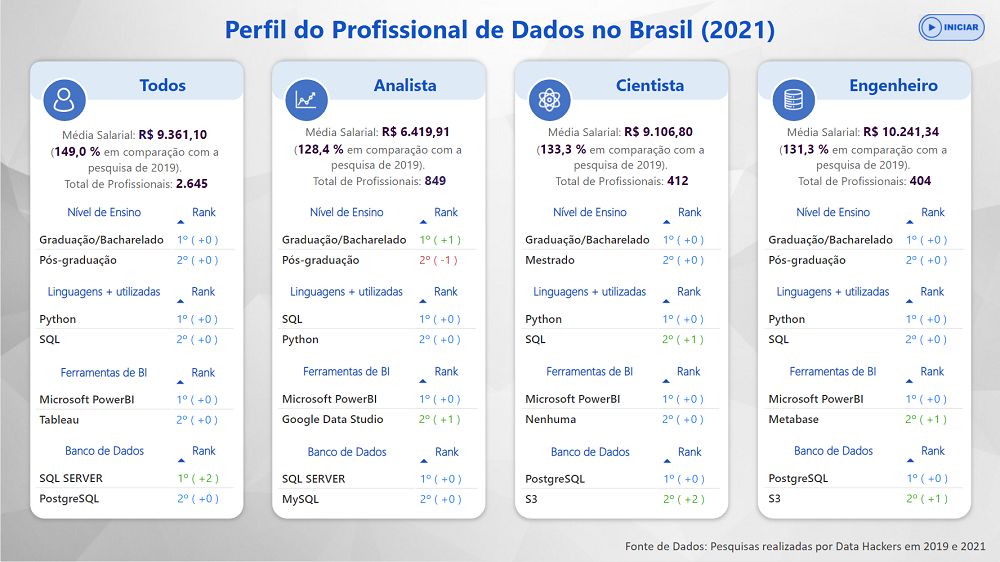
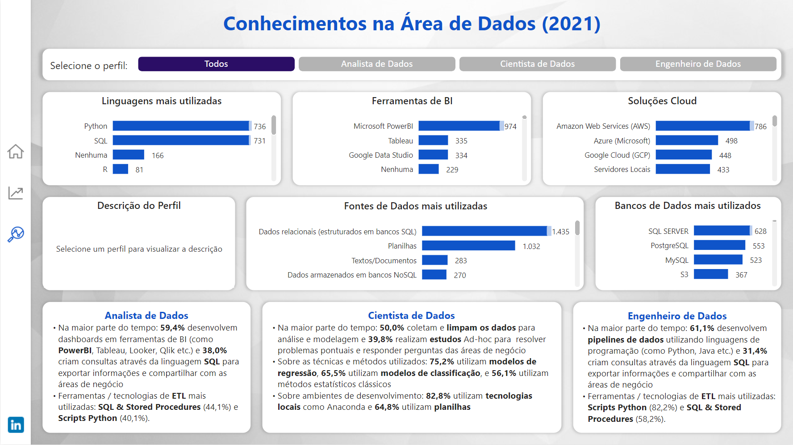

# Profissional de Dados do Brasil

## **Introdução do Problema**

Você conhece o perfil do Profissional de Dados do Brasil? 

Se você é um profissional de dados ou está pensando em migrar de carreira ou está interessado em saber melhor como é este profissional, precisa conhecer as atualizações da última pesquisa realizada pelo Data Hackers. 

**Problema**: Identificar e reportar em forma de dashboard as informações mais relevantes do profissional de dados no Brasil. 

**Dataset**: Dados foram extraídos do Kaggle do Data Hackers
* Link para os dados da Pesquisa de 2021: 
* Link para os dados da Pesquisa de 2019: 

**Desenvolvimento**: Para o desenvolvimento do dashboard, utilizei os dados da pesquisa de 2021 e de 2019 para fins comparativos. 
* Na "Página Inicial", podemos visualizar um resumo com as comparações salariais, nível de ensino e ferramentas mais presentes no dia a dia do profissional.

* Em "Demografia e Carreira", trago os dados de 2021, e podemos analisar os perfis em relação ao nível

* Em "Conhecimentos na Área de Dados", podemos extrair informações mais específicas dos perfis como por exemplo, ferramentas e linguagens mais utilizadas e atividades do dia a dia.

**Conclusão**: As principais conclusões que podemos extrair dessas informações:
* Aumento salarial significativo independente do perfil.
* As linguagens mais utilizadas continuam sendo: Python e SQL.
* A ferramenta de BI que continua em primeiro lugar é o Power BI.
* Os bancos de dados mais utilizados são: SQL Server e PostgreSQL.
* A possibilidade de trabalhar com dados em diversos setores do mercado.
* Maior média salarial em empresas de porte grande e médio.
* Analista de Dados passa a maior parte de tempo desenvolvendo dashboards em ferramentas de BI e criando consultas em SQL.
* Cientista de Dados passa a maior parte do tempo coletando e limpando os dados para análise e criação de modelos, além disso realizam estudos para  resolver problemas de negócio 
* Engenheiro de Dados passa a maior parte do tempo desenvolvendo pipeline de dados e criando consultas em SQL.

Para acessar o dashboard, clique neste link: ( [powerbi_publiclink] )
